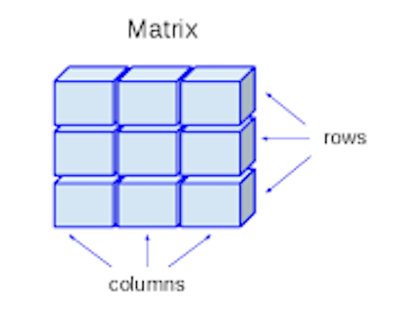
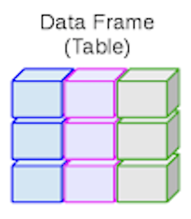
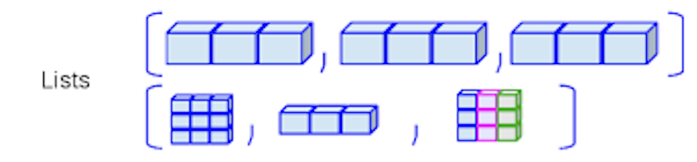

Introducción a R
========================================================
author: Alán Ponce
date: 
autosize: true
<!-- transition: rotate -->

Agenda:
- Consideraciones generales
- RStudio IDE y datos en R
- Aritmética
- Variables y tipos de datos
- Vectores   
- Matriz
- Factores
- Data frames
- Listas

Consideraciones generales
========================================================
type: section


RStudio IDE
========================================================

<div align="center">

</div>

<!--  -->

Estructura de datos en R
========================================================

<div align="center">

</div>

<!--  -->


Aritmética con R
========================================================
type: section

Aritmética con R
========================================================
El uso más simple que se le puede dar a R es el de una calculadora.

- Adición: +   
- Resta: -   
- Multiplicación: *   
- División: /   


Aritmética con R
========================================================


```r
# Suma
7 + 9
```

```
[1] 16
```

```r
# Resta
25 - 12
```

```
[1] 13
```

```r
# Multiplicacion
4 * 8
```

```
[1] 32
```

```r
# Division
(5 + 5)/2
```

```
[1] 5
```

Aritmética con R
========================================================

- Exponenciación: ^   
- Modulo: %%   


```r
#El operador ^ eleva el número a la izquierda a la potencia a la derecha
3 ^ 2
```

```
[1] 9
```

```r
#El módulo (mod) %% calcula el residuo de la división
5 %% 3
```

```
[1] 2
```

Variables y asignaciones
========================================================
type: section

Variables y asignaciones
========================================================
Un concepto básico en programación es el de variable.

Una variable nos permite guardar valores (por ejemplo el número 4) o algún objeto (veremos mas adelante de que se trata) en R. Luego puedes acceder al valor guardado en la variable por medio del nombre de la misma.


```r
# Asigna 42 a x
x <- 42

# Imprime el valor de la variable x
#x
print(x)
```

```
[1] 42
```

Tipos de datos básicos en R
========================================================
R trabaja con muchos tipos de datos. Para empezar, algunos de los más básicos son:

- Decimales como 4.5 son llamados *numeric* (numéricos).
- Números enteros como 4 son llamados *integer* (enteros).
- Valores Booleanos (TRUE (Verdadero) o FALSE (Falso)) *logical* (lógicos).
- Texto (cadenas de caracteres) son *characters* (caracteres).

Tipos de datos básicos en R
========================================================


```r
# Un valor numérico
mi_numero <- 42.5

# Asignando una cadena de caracteres (o simplemente caracteres) nota el uso de las comillas
mi_caracter <- "cuarenta_y_dos"

# Asignando un valor lógico verdadero
mi_logica <- TRUE
```

Tipos de datos básicos en R
========================================================


```r
# Verifica el tipo  de la variable
class(mi_numero)
```

```
[1] "numeric"
```

```r
# Verifica el tipo  de la variable
class(mi_caracter)
```

```
[1] "character"
```

```r
# Verifica el tipo  de la variable
class(mi_logica)
```

```
[1] "logical"
```

Vectores en R
========================================================
type: section

Un vector es un arreglo unidimensional que puede contener datos numéricos, caracteres, o valores lógicos.

<div align="center">

</div>


Tipos de Vectores
========================================================


```r
vector_numerico <- c(1, 10, 49)

vector_caracter <- c("a", "b", "c")

vector_logico <- c(TRUE, FALSE, TRUE)
```

Matriz en R
========================================================
type: section

Es un conjunto de elementos del mismo tipo (numérico, caracter o lógico) arreglados de forma rectangular en filas y columnas.

<div align="center">

</div>


Matriz
========================================================

Como una matriz se compone de filas y columnas decimos que es un objeto de dos dimensiones.


```r
# Construcción de una matriz de 3 filas que contiene los número del 1 al 9.
matrix(1:9, byrow = TRUE, nrow = 3)
```

```
     [,1] [,2] [,3]
[1,]    1    2    3
[2,]    4    5    6
[3,]    7    8    9
```

Factores
========================================================
type: section

El termino factor se refiere a un tipo de datos utilizado por R para almacenar variables categóricas.

Factores
========================================================
Las variables categóricas  son aquellas que pueden variar dentro de un número limitado de categorías. 


```r
genero <- c("Masculino", "Femenino", "Femenino", "Masculino", "Masculino")

# Define factor_genero usando la función  factor()
factor_genero <- factor(genero)

factor_genero
```

```
[1] Masculino Femenino  Femenino  Masculino Masculino
Levels: Femenino Masculino
```

Data frame
========================================================
type: section

Es una estructura de datos rectangular, que contiene las variables en las columnas y las observaciones en las filas.

<div align="center">

</div>

Data frame
========================================================
 Piensa en un data frame como una hoja de MS Excel o quizás estas familiarizado con otros paquetes estadísticos como SAS o SPSS.


```r
head(iris)
```

```
  Sepal.Length Sepal.Width Petal.Length Petal.Width Species
1          5.1         3.5          1.4         0.2  setosa
2          4.9         3.0          1.4         0.2  setosa
3          4.7         3.2          1.3         0.2  setosa
4          4.6         3.1          1.5         0.2  setosa
5          5.0         3.6          1.4         0.2  setosa
6          5.4         3.9          1.7         0.4  setosa
```

```r
#View(iris)
```


Data frame: estructura
========================================================
Esta función muestra la estructura de un data frame (u otro objeto de R)


```r
str(iris)
```

```
'data.frame':	150 obs. of  5 variables:
 $ Sepal.Length: num  5.1 4.9 4.7 4.6 5 5.4 4.6 5 4.4 4.9 ...
 $ Sepal.Width : num  3.5 3 3.2 3.1 3.6 3.9 3.4 3.4 2.9 3.1 ...
 $ Petal.Length: num  1.4 1.4 1.3 1.5 1.4 1.7 1.4 1.5 1.4 1.5 ...
 $ Petal.Width : num  0.2 0.2 0.2 0.2 0.2 0.4 0.3 0.2 0.2 0.1 ...
 $ Species     : Factor w/ 3 levels "setosa","versicolor",..: 1 1 1 1 1 1 1 1 1 1 ...
```

Creando un data frame
========================================================
Creando los vectores


```r
planetas <- c("Mercurio", "Venus", "Tierra");

tipo <- c("Planeta Terrestre", "Planeta Terrestre", "Planeta Terrestre")

diametro <- c(0.382, 0.949, 1); 

rotacion <- c(58.64, -243.02, 1);

anillos <- c(FALSE, FALSE, FALSE);
```

Creando un data frame
========================================================
Asignando los vectores a un data frame


```r
# Crea el data frame:
planetas_df   <- data.frame(planetas, tipo, diametro, rotacion, anillos)

planetas_df
```

```
  planetas              tipo diametro rotacion anillos
1 Mercurio Planeta Terrestre    0.382    58.64   FALSE
2    Venus Planeta Terrestre    0.949  -243.02   FALSE
3   Tierra Planeta Terrestre    1.000     1.00   FALSE
```


Listas
========================================================
type: section

Una lista es una estructura de datos que permite a R agrupar muchos objetos en un solo lugar y de manera ordenada.

Estos objetos pueden ser matrices, vectores, data frames, otras listas, etc

<div align="center">

</div>

Listas
========================================================


```r
# Vector con números del 1 al 10
mi_vector <- 1:10 

# Matriz con números del 1 al 9
mi_matriz <- matrix(1:9, ncol = 3)

# Primeras 10 filas del data frame mtcars (incluido con R).
mi_df <- iris[1:10,]
```

Listas
========================================================


```r
# Crea la lista que contenga como componentes las variables arriba definidas:
mi_lista <- list(mi_vector, mi_matriz, mi_df)
```

Listas
========================================================


```r
mi_lista
```

```
[[1]]
 [1]  1  2  3  4  5  6  7  8  9 10

[[2]]
     [,1] [,2] [,3]
[1,]    1    4    7
[2,]    2    5    8
[3,]    3    6    9

[[3]]
   Sepal.Length Sepal.Width Petal.Length Petal.Width Species
1           5.1         3.5          1.4         0.2  setosa
2           4.9         3.0          1.4         0.2  setosa
3           4.7         3.2          1.3         0.2  setosa
4           4.6         3.1          1.5         0.2  setosa
5           5.0         3.6          1.4         0.2  setosa
6           5.4         3.9          1.7         0.4  setosa
7           4.6         3.4          1.4         0.3  setosa
8           5.0         3.4          1.5         0.2  setosa
9           4.4         2.9          1.4         0.2  setosa
10          4.9         3.1          1.5         0.1  setosa
```


```
[[1]]
 [1]  1  2  3  4  5  6  7  8  9 10

[[2]]
     [,1] [,2] [,3]
[1,]    1    4    7
[2,]    2    5    8
[3,]    3    6    9

[[3]]
   Sepal.Length Sepal.Width Petal.Length Petal.Width Species
1           5.1         3.5          1.4         0.2  setosa
2           4.9         3.0          1.4         0.2  setosa
3           4.7         3.2          1.3         0.2  setosa
4           4.6         3.1          1.5         0.2  setosa
5           5.0         3.6          1.4         0.2  setosa
6           5.4         3.9          1.7         0.4  setosa
7           4.6         3.4          1.4         0.3  setosa
8           5.0         3.4          1.5         0.2  setosa
9           4.4         2.9          1.4         0.2  setosa
10          4.9         3.1          1.5         0.1  setosa
```


Ejercicios
========================================================
type: section

[Introducción a R](https://www.datacamp.com/community/open-courses/introduccion-a-r)
